# PyQGIS Tutorial

This tutorial serves as an introduction to both QGIS and the use of Python scripting within the QGIS platform. It was developed as a final project for IDCE 30274 Computer Programming for GIS taught by Professor Shadrock Roberts at Clark University in Fall 2020. Questions, comments, and suggestions should be directed to Jess Strzempko either at JeStrzempko@clarku.edu or JessStrzempko@gmail.com. Her GitHub profile can be found [here](https://github.com/jstrzempko). 

### Objectives

* To introduce users to the use of Python scripting in QGIS
* To promote the use of open source software through a demonstration of its capabilities
* To explore the ACLED US Crisis Monitor dataset

### Data

Data for this tutorial is sourced from [ACLED](acleddata.com), the Armed Conflict Location & Event Data Project. ACLED is a registered non-profit organization with 501(c)(3) status operating in the United States that compiles spatial and attribute data on worldwide crises. These include political violence, civil and communal conflicts, violence against civilians, remote violence, rioting, and protesting. ACLED has [teams of research analysts](https://acleddata.com/about-acled/) that collect, analyze, and map events in these regions: Africa, East Asia, South Asia, Southeast Asia, the Middle East, Central Asia and the Caucasus, Latin America and the Caribbean, and Southeastern and Eastern Europe and the Balkans. 

In addition to location data, disaggregated information on the dates, actors, fatalities, and types of conflict is gathered and verified through media outlets. Decisionmaking and documentation behind the methodology can be found [here](https://acleddata.com/resources/methodology/). This tutorial will specifically be using data from the [US Crisis Monitor](https://acleddata.com/special-projects/us-crisis-monitor/), a new project begun by ACLED in 2020 in response to increased domestic civil unrest following the murder of [George Floyd](https://en.wikipedia.org/wiki/George_Floyd) by Minneapolis police. In collaboration with the Bridging Divides Initiative (BDI) at Princeton University, ACLED launched the US Crisis Monitor to support and empower local communities through access to real-time evidence of demonstrations, protesting and violence. Nowadays, Americans are faced with an insidious combination of [white supremacist extremism](https://www.theguardian.com/australia-news/audio/2020/nov/03/us-election-2020-trump-and-the-rise-of-white-supremacist-extremism) and [political partisanship](https://www.cbsnews.com/news/second-stimulus-check-status-update-2020-11-24/) exacerbated by a global pandemic and fascist president. The US data ACLED gathers and shares aims to provide communities with useful information on risks, conflict hotspots, and resources needed to keep community members safe and healthy. 

Both the data and analysis performed by ACLED is free for use, which is why we will be employing it in this tutorial. The outputs are merely educational and exploratory and should not be treated as academically rigorous results. Use of ACLED data for research should involve a [critical examination of the quality and methodology](https://journals.sagepub.com/doi/abs/10.1177/0010836711434463) behind the data collection and analysis, with an eye toward biased findings and reliance on media sources. Comments and questions about the ACLED dataset should be directed toward admin@acleddata.com. 


Data should be downloaded from [the US Crisis Monitor site](https://acleddata.com/special-projects/us-crisis-monitor/). It should then be opened in Excel and saved as a CSV UTF-8 (Comma Delimited) (`.csv`) file for ease of use with QGIS (and other software). Should problems arise, a back-up version of the `.csv` file is provided in the data folder within this repository. Once you have downloaded the file and put it in the appropriate location, open it (`USA_2020_Nov21.csv`) and inspect the different attribute fields, taking note of the LONGITUDE and LATITUDE fields. 

## Tutorial Steps

### Downloading QGIS 

QGIS can be downloaded for free from the [QGIS website](download.qgis.org). This tutorial will explain some points of confusion surrounding the process, but assumes users have previous experience downloading programs to their personal computers. QGIS can be downloaded for Windows, MacOS X, Linux, BDS, and Android. This tutorial will focus on a Windows downloads. Assistance with other operating systems can be found on the [QGIS Installers page](https://qgis.org/en/site/forusers/alldownloads.html). 

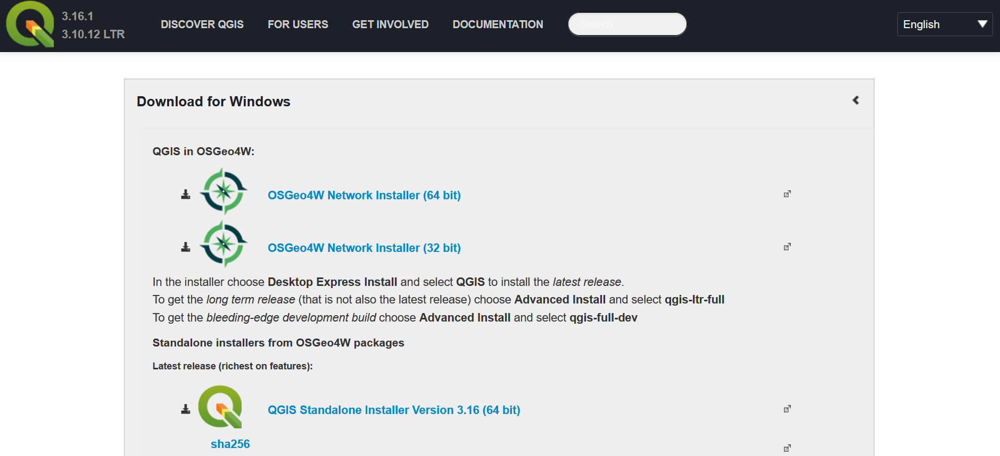

The first question that arises when downloading QGIS is - what is OSGeo4W? A [nice and quick explanation](https://gis.stackexchange.com/questions/164976/what-is-osgeo4w) of OSGeo and OSGeo4W can be found by StackExchange user HeikkiVesanto. To paraphrase, OSGeo, [The Open Source Geospatial Foundation](https://www.osgeo.org/) supports open source GIS projects like QGIS, GeoServer, and OpenLayers, offering legitimacy and quality assurance. OSGeo4W is a Windows installer for Open Source GIS projects. It keeps track of the dependencies (reliance of one piece of software on another) of Open Source GIS packages, ensuring that one install of programs like Python, GDAL, or GRASS can be shared among softwares. It also maintains software versions so you can easily upgrade programs. 

I would recommend downloading using OSGeo4W if you intend to perform further GIS/programming work on your personal computer. Having dependencies already installed can be incredibly useful in the future and save time and energy (and prevent frustration). However, if you feel that your foray into Open Source GIS will be limited, I would suggest downloading using the QGIS Standalone Installer. Choice of 32 vs 64 bit depends on [what processor](https://www.techsoup.org/Support/articles-and-how-tos/do-i-need-the-32bit-or-64bit) your personal computer has. I would recommend downloading the 64-bit since most modern personal computers have 64-bit processors, but if you are concerned you should check. 

**<p align="center"> After downloading OSGeo4W from the above website, open the OSGeo4W Net Release Setup Program and you should see the below screen. Select Advanced Install then Next. </p>**

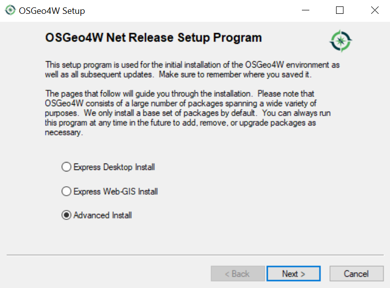

**<p align="center"> We will be downloading from the internet, so ensure you have a strong wifi connection before performing the below steps. Choose Install from Internet then Next. </p>**

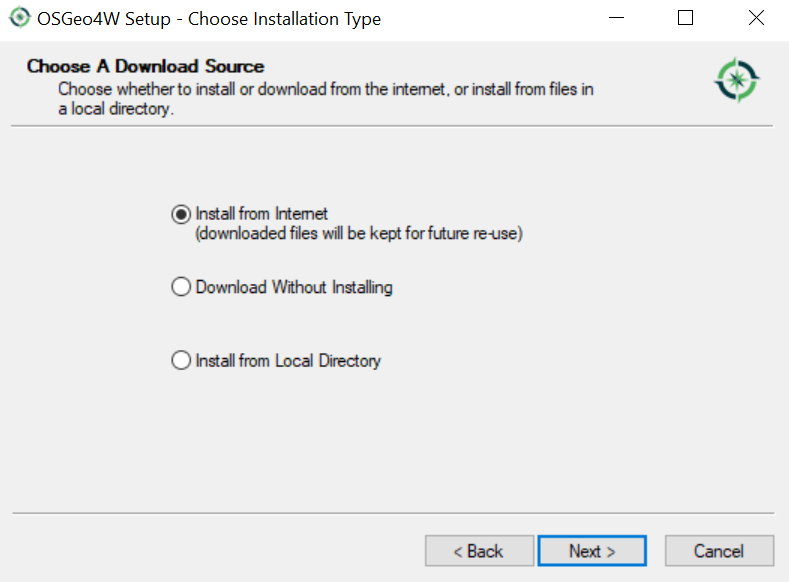

**<p align="center"> Choose the Installation Directory. I typically leave the Root Directory as the default and opt to add an icon on both my Desktop and Start Menu. </p>**

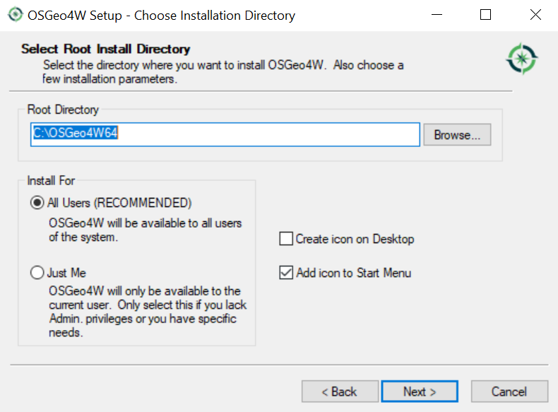

**<p align="center"> Select Local Package Directory. Again, leaving this as the default option is a good decision. </p>**

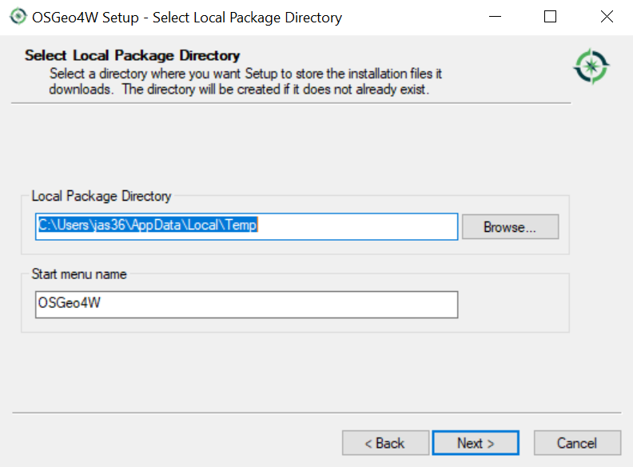

**<p align="center"> Select your Internet Connection type. Most often, this will be Direct Connection. </p>**

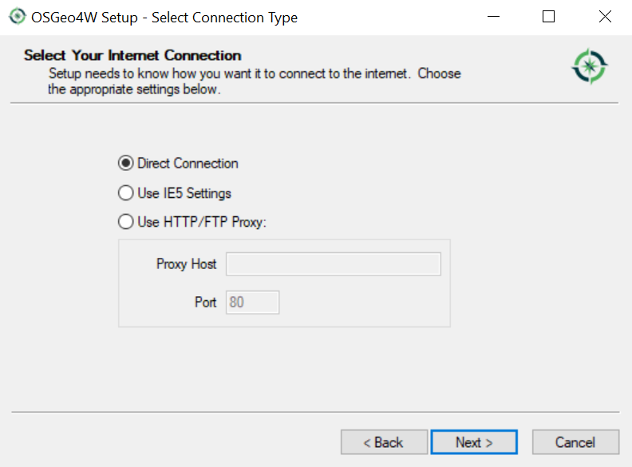

**<p align="center"> Choose a download site. I generally select one of the OSGeo ones. </p>**

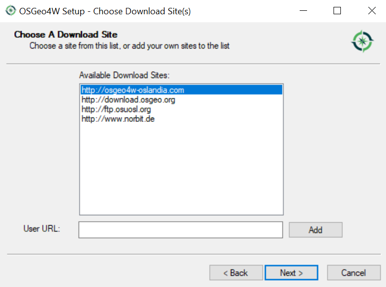

**<p align="center"> Here, you will select the packages to install. As you can see in the below screenshot, I have version 3.12.3-1 of QGIS already installed, but can update to 3.16.0-1 by hitting Skip next to the Package name to change the action performed. Do this for qgis: QGIS Desktop. Don't worry about dependencies for now and don’t blindly do a full install of available packages. Select Next. </p>**

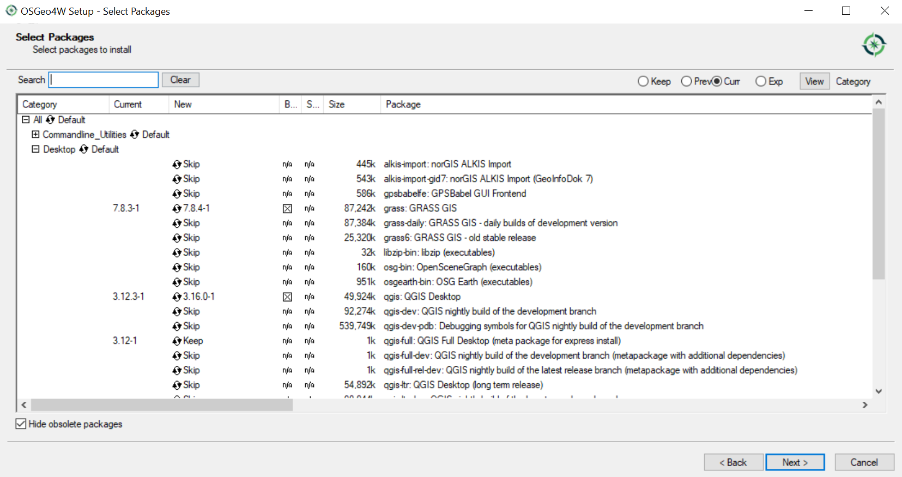

**<p align="center"> Here are the dependencies! OSGeo4W will resolve them for you by installing them at the same time. If these components are not installed, your QGIS copy will be rendered unusable. Ensure the box to install them is selected at the bottom of the page. </p>**

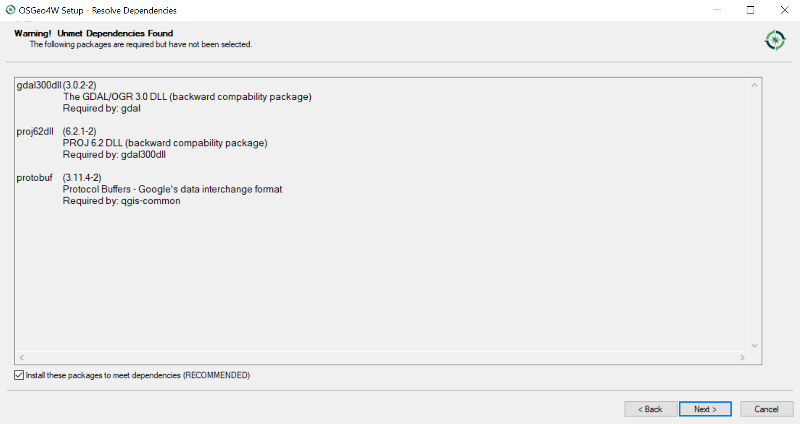

**<p align="center"> Now, when you go to your start menu and type QGIS you should see the QGIS 3 App! Select it to get started. </p>**

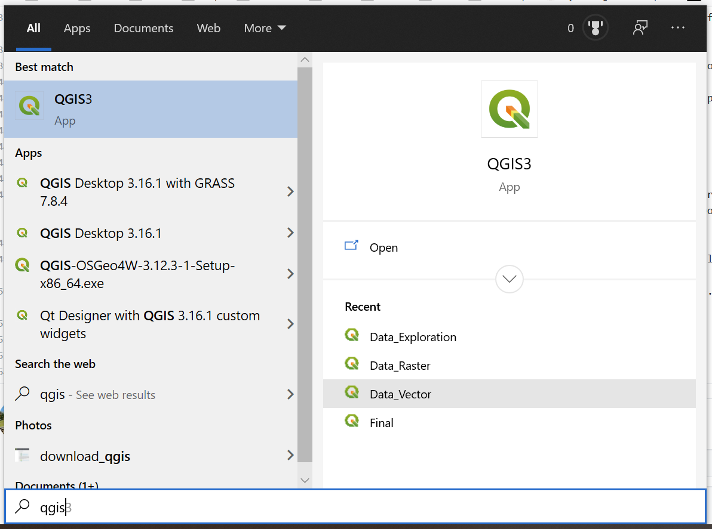

### PyQGIS

Once you have opened QGIS, explore the menu and buttons. The user interface is very similar to that of ArcMap. If you would like to get familiar with the software and explore its capabilities, I suggest following along with [another tutorial](https://www.youtube.com/watch?v=kCnNWyl9qSE&vl=en). Open the Python Console by either clicking the toolbar button, as is shown in the screenshot below, or by going to Plugins > Python Console in the top ribbon. 

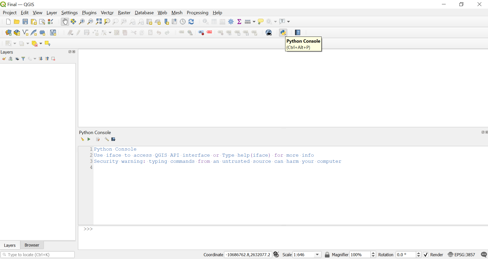

Similar to the way `import arcpy` is run automatically when the Python console is opened in ArcMap, the following statements are executed in the QGIS Python console as an initial default. Since we will be working within the console, there is no need to run these lines of code, but it is good to know. 

```
from qgis.core import *
import qgis.utils
```

#### Importing CSV File

First thing we will do is run the following command in the Python console. Within the miscellaneous operating system interfaces (`os`), we will use the `.getcwd()` function to get the current working directory. You can copy and paste the code below or type it in yourself after the `>>>` symbol in the bottom of the console. You can then press Enter or hit the Run Command button (small blue triangle) as shown below. As you can see, my current working directory is `'C:\\Users\\jas36\\Documents'`.

```
os.getcwd()
```


From here on out, we will be making use of the Editor, which can be accessed by pressing the small icon of a paper and pen as shown below. 


This will bring up the Editor window next to the Python console. Make the Editor larger than the console by moving the divider between the two to the left. We will use the Editor to construct a script that can be run all at once (instead of line by line in the console). 


Next, we will need the path to the ACLED file we want to access. We only need to know the subfolders that the file resides in beyond the working directory. So, in my case, we will already be starting in the Documents folder and only need to construct the path name from there. I suggest finding the full file path by opening the File Explorer and navigating to the file, named something like `USA_2020_Nov21.csv`. Right click the file and select Properties to find the file location as shown below. Copy the entire file path starting from the drive (C: drive in my case) for use in the following exercises. 


To import the csv file, we would normally use the QGIS Graphic User Interface (GUI) to select Layer > Add Layer > Add Delimited Text Layer. From there we would select the correct file name and select the option for a CSV file format. This is shown below for those unfamiliar with the QGIS GUI.


Instead, will construct a script to do this for us! The first thing we will create is a string that gives the file path within the Editor. All QGIS file paths must begin with `file:///`. Assign your file path the name `path1` and finish it with the file name and extension. See my example below. 

```
path1 = "file:///C:/Users/jas36/Documents/Clark/Year 5/Comp_Prog/Class_Materials/Final/USA_2020_Nov21.csv"
```

Next, we will add to this path so that QGIS can recognize our file type and interpret the proper fields to plot the location of the point data. Add `?type=csv` to the end of the file path string. Next, add `&xField=LONGITUDE` and `&yField=LATITUDE` immediately after this. This tells QGIS to look for a csv file with the field names LONGITUDE and LATITUDE for the x and y fields for plotting. 

```
path1 = "file:///C:/Users/jas36/Documents/Clark/Year 5/Comp_Prog/Class_Materials/Final/USA_2020_Nov21.csv?type=csv&xField=LONGITUDE&yField=LATITUDE"
```

Next, we will use the `QgsVectorLayer` function to construct a vector layer using our path name then we will add this layer to the map. The format is `layer = QgsVectorLayer(data_source, layer_name, provider_name)` where layer_name will be the name assigned to the layer in the Table of Contents. In our instance, provider_name is "delimitedtext," a more general term for a CSV file in which delimiters can be more than just commas. See my example below to add to your script. 

```
layer1 = QgsVectorLayer(path1, "ACLED_Nov2020", "delimitedtext")
QgsProject.instance().addMapLayer(layer1)
```

Run the script using the Run Script button in the top ribbon of the Editor. The layer should appear in your Table of Contents (TOC). If you are unable to see the points in the window, right click on the layer and select Zoom to Layer. You should see a rough outline of the US constructed out of points. 

Note the box with the question mark next to the layer that says "Layer has no coordinate reference system set!" when hovered over. We can modify our existing script to fix this and set a coordinate reference system in one fell swoop. First, we must remove the unreferenced layer. Run the below code in the console (not the Editor), and the layer should disappear from the TOC. 

```
QgsProject.instance().removeMapLayer(layer1)
```

Copy and paste path1 to create path2 directly below it. Comment out path1. In path2, add `&crs=EPSG:3857` to the end. EPSG 3587 is a Spherical Mercator projection coordinate system used by web services such as Google and OpenStreetMap.

```
path2 = "file:///C:/Users/jas36/Documents/Clark/Year 5/Comp_Prog/Class_Materials/Final/USA_2020_Nov21.csv?type=csv&xField=LONGITUDE&yField=LATITUDE&crs=EPSG:3857"
```

There are other ways to construct this file path. For instance, replacing `?type=csv` with `?delimiter=,` to create a path name like so. 

```
path3 = "file:///C:/Users/jas36/Documents/Clark/Year 5/Comp_Prog/Class_Materials/Final/USA_2020_Nov21.csv?delimiter=,&xField=LONGITUDE&yField=LATITUDE&crs=EPSG:3857"
```

An even fancier method is to employ the `.format()` and `os.getcwd()` functions. See below. 

```
path4 = "file:///{}/Clark/Year 5/Comp_Prog/Class_Materials/Final/USA_2020_Nov21.csv?delimiter={}&xField={}&yField={}&crs={}".format(os.getcwd(), ",", "LONGITUDE", "LATITUDE", "EPSG:3857")
```

Additionally, we can use an if-else statement to only add the layer to the map if it is valid. See below. 

```
vlayer = QgsVectorLayer(path_to_airports_layer, "Airports layer", "ogr")
if not vlayer.isValid():
    print("Layer failed to load!")
else:
    QgsProject.instance().addMapLayer(vlayer)
```

Feel free to construct a script that works best for you (so long as it accomplishes the task of adding the correct layer to the map). 

#### Next Step


### Credits

[PyQGIS 101](https://anitagraser.com/pyqgis-101-introduction-to-qgis-python-programming-for-non-programmers/)
