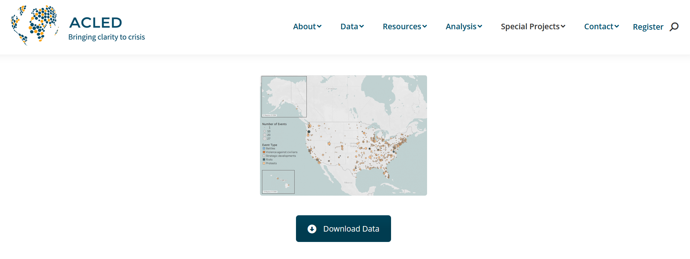

# PyQGIS Tutorial

This tutorial serves as an introduction to both QGIS and the use of Python scripting within the QGIS platform. It was developed as a final project for IDCE 30274 Computer Programming for GIS taught by Professor Shadrock Roberts at Clark University in Fall 2020. 

### Objectives

* To introduce users to the use of Python scripting in QGIS
* To promote the use of open source software through a demonstration of its capabilities
* To explore the ACLED US Crisis Monitor dataset

### Data

Data for this tutorial is sourced from [ACLED](acleddata.com), the Armed Conflict Location & Event Data Project. ACLED is a registered non-profit organization with 501(c)(3) status operating in the United States that compiles spatial and attribute data on worldwide crises. These include political violence, civil and communal conflicts, violence against civilians, remote violence, rioting, and protesting. ACLED has [teams of research analysts](https://acleddata.com/about-acled/) that collect, analyze, and map events in these regions: Africa, East Asia, South Asia, Southeast Asia, the Middle East, Central Asia and the Caucasus, Latin America and the Caribbean, and Southeastern and Eastern Europe and the Balkans. 

In addition to location data, disaggregated information on the dates, actors, fatalities, and types of conflict is gathered and verified through media outlets. Decisionmaking and documentation behind the methodology can be found [here](https://acleddata.com/resources/methodology/). This tutorial will specifically be using data from the [US Crisis Monitor](https://acleddata.com/special-projects/us-crisis-monitor/), a new project begun by ACLED in 2020 in response to increased domestic civil unrest following the murder of [George Floyd](https://en.wikipedia.org/wiki/George_Floyd) by Minneapolis police. In collaboration with the Bridging Divides Initiative (BDI) at Princeton University, ACLED launched the US Crisis Monitor to support and empower local communities through access to real-time evidence of demonstrations, protesting and violence. Nowadays, Americans are faced with an insidious combination of [white supremacist extremism](https://www.theguardian.com/australia-news/audio/2020/nov/03/us-election-2020-trump-and-the-rise-of-white-supremacist-extremism) and [political partisanship](https://www.cbsnews.com/news/second-stimulus-check-status-update-2020-11-24/) exacerbated by a global pandemic and fascist president. The US data ACLED gathers and shares aims to provide communities with useful information on risks, conflict hotspots, and resources needed to keep community members safe and healthy. 

Both the data and analysis performed by ACLED is free for use, which is why we will be employing it in this tutorial. The outputs are merely educational and exploratory and should not be treated as academically rigorous results. Use of ACLED data for research should involve a [critical examination of the quality and methodology](https://journals.sagepub.com/doi/abs/10.1177/0010836711434463) behind the data collection and analysis, with an eye toward biased findings and reliance on media sources. Comments and questions about the ACLED dataset should be directed toward admin@acleddata.com. 

Data should be downloaded from [the US Crisis Monitor site](https://acleddata.com/special-projects/us-crisis-monitor/). It should then be opened and saved as a CSV UTF-8 (Comma Delimited) (`.csv`) file for ease of use with QGIS (and other software). Should problems arise, a back-up version of the `.csv` file is provided in the data folder within this repository. 

## Tutorial Steps

### Downloading QGIS 

* downloading QGIS: [download.qgis.org](download.qgis.org)

### PyQGIS
* work with the data (in qgis in the python console)
